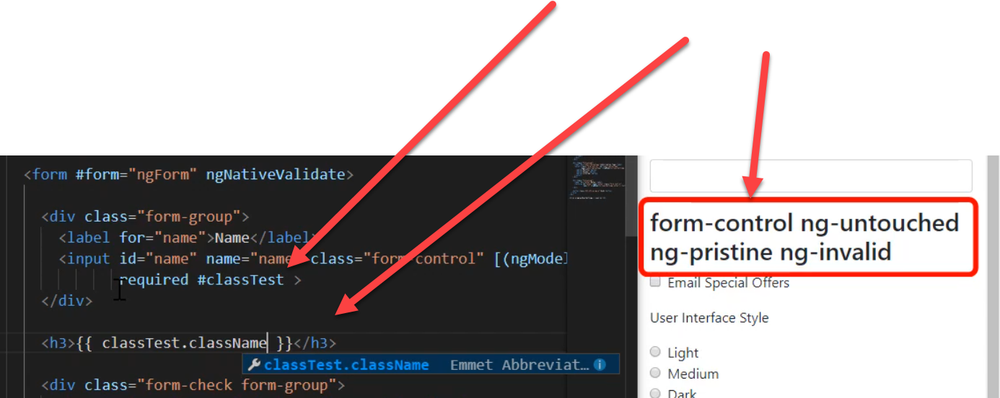

# Form Validation

## HTML5 Validation Attributes


The **MDN** has a great section about [HTML5 Form Validation](https://developer.mozilla.org/en-US/docs/Learn/HTML/Forms/Form_validation). It's a highly recommended read.


### required

Makes something... well, required.

### pattern

Specify a Regex pattern to check input against


Check out [RegExr ](https://regexr.com/)for a fantastic Regular Expression resource.


### minlength and maxlength

Specify the minimum and maximum length of a string

### min and max

Specify the minimum and maximum value of a number

## [Angular Validation](https://angular.io/guide/form-validation) Classes

### ng-untouched / ng-touched

Elements begin with the **ng-untouched** class and will gain or lose it inversely with **ng-touched** as the element is **blurred or focused.**

### **ng-pristine / ng-dirty**

Elements begin with the class **ng-pristine** until they are modified for the first time, at which point they lose that class and gain the class **ng-dirty.**

### **ng-valid / ng-invalid**

Elements will also have either the **ng-valid** class or the **ng-invalid** class depending on whether or not the element currently has a valid value according to the **HTML.**



In this Pluralsight video screenshot, we see a **template reference variable** being assigned as an attribute to this `<input>` element. This allows us to access it's properties as though it were an **object** using **interpolation brackets**: `{{ ... }}`. 

The **currently applied classes** can the be seen on the right within the `<h3>`.

### [ngNativeValidate](https://github.com/angular/angular/blob/master/packages/forms/src/directives/ng_no_validate_directive.ts)

Note the use of the **ngNativeValidate** directive in the `<form>` element in the above example. This is required for Angular to use the browsers' native validation.

## Submitting Forms

### onSubmit Event Binding

Binding to a form's **onSubmit** event is a lot like binding to an element's **click event**. The main difference is that the **handler function** that we supply will need to be passed the **template reference variable** to which we assigned the instance of our **ngForm**:

In our HTML template...

```markup
<form #form="ngForm" (onSubmit)="onSubmit(form)">
    ...
</form>
```

In our component...

```typescript
import { NgForm } from '@angular/forms';
// ...
onSubmit(form: NgForm) {
    //...
}
```


The **handler function** for the **onSubmit** event does **not have to be named the same thing.** It just happens to be in this example and is generally considered a best practice for the sake of readability.


### Handler Function Validation

In order to handle validation in our **submit handler** vs using the native browser's validation, some changes need to be made to the form's input controls:

```markup
<input class="form-control"
        id="name"
        name="name"
        required
        [(ngModel)]="userSettings.name"
        #nameField="ngModel"
        [class.field-error]="form.submitted && nameField.invalid">
<div [hidden]="!form.submitted || nameField.valid"
        class="alert alert-danger">
    Enter a name
</div>
```

First, we need to set the element to a **template reference variable** equal to **"ngModel"**. This will set the element to **its place** _**within**_ **the ngModel object** that we bound to using `[()]`as shown on line 5.

Next, we can add a **conditional class** using the syntax: `[class.<conditional-class-name>]="<expression>"`. The expression to evaluate here is checking two properties that Angular **automatically sets** to elements: the **form's submitted** property and the **template reference variable, nameField here, invalid** property. 

Setting it in this way _prevents_ the `field-error` class from being applied to the element _unless_ the **ngForm object** has a value of **true** for **submitted** and the **element itself** has a property of **invalid** set to **true**.

Lastly, the error itself in the example is rendered using a `<div>` with its `hidden` attribute bound to a conditional express just like the `[class.field-error]` in the example above: if the **form** is **not yet submitted** or if the **nameField** is **valid,** this div will be `hidden`.

## Form Control Events

Using functions **bound** to **events** such as the **onBlur** event can also be an effective means of validating the form data.


